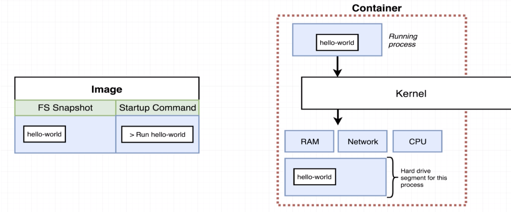
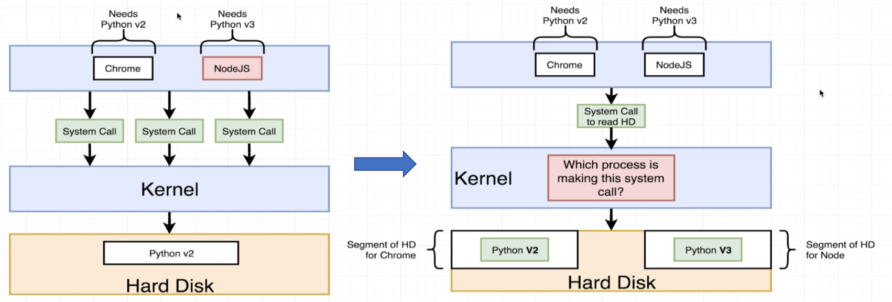
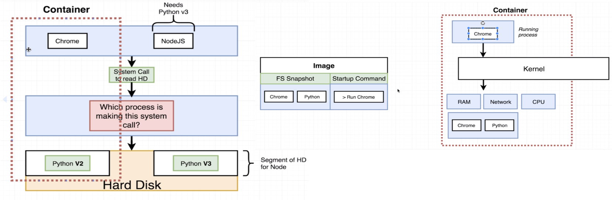

#About Docker

**Image**: Single file with all dependencies and config.

**Container**: Instance of an Image, runs program.

**Docker CLI**: where to issue commands.

**Docker Server(DAEMON)**: tool for creating image and container.

Flow:
`docker run hello-world` the client gives out command. `Docker Server` will search in *Image Cache* for hello-world Image. If there is no such image, it will search in `Docker Hub`. Then it will download the image and load the file into memory and **create** a container and then **start** a single program inside.
____

**Why Docker?**
: Processes have different dependencies.

The solution is to allocate different HD segment for the apps.

What container do is allocate hardware (by *Namespacing and Control Groups*, which only for Linux. So the docker runs on Linux Virtual Machine under Windows and MacOS.) especially for the corresponding `Image`, and have the process running.

____

**Lifecycle**:

* `docker create`: create a container with command
* `docker start -a` or `docker start` + *Container ID* : start a container created, and run the command again (the default command is decided when creating the container, cannot be changed)

**Docker Commands**:

`docker ps`: show docker container running now

`docker ps --all`: all docker container created(included container shutted down)

`docker system prune`: remove all stopped containers, unused network, dangling images and build cache.

`docker logs <Container ID>`: retrieve all the emitted information of the container.

Stop a running container:

* `docker kill`: send a kill signal to the process, shut down right now 
* `docker stop`: send terminal signal to the process, safely stop the process and stop the container (if >10s, automatically kill)

`docker exec -it <Container ID> <Command>`: Execute an additional command in a container(*need a new terminal*).(`-it` means `-i` build STDIN tunnel bridging the container and the terminal, and `-t` show formatted text in the terminal)

* `docker exec -it <Container ID> sh`: open a terminal/shell in the container
* `docker run -it <image name> sh`: create and run container and then run the shell