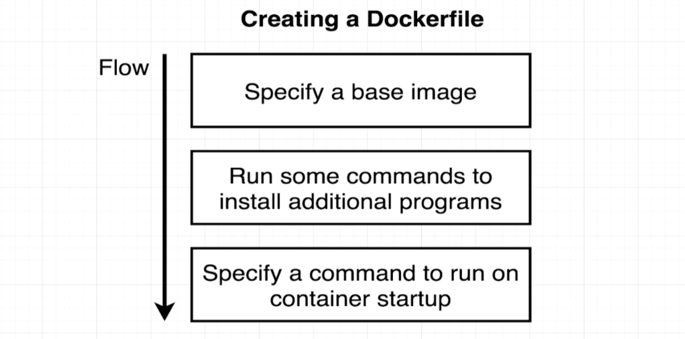

# Create Docker Image

Dockerfile --> Docker Client --> Docker Server --> Image

So how to create Docker File?



``` Docker
# Use an existing dockr image as a base(just like install an OS)
FROM alpine

# Download and install dependencies(apk is a package manager in alpine, this step can also be done in shell of the alpine container)
RUN apk add --update redis

# CMD tells the image what to do when start as a container, but not to execute in the intermediate container (this can also be manually added, see last part of this page)
CMD ["redis-server"]
```

`docker build .` in the terminal, will build the image with image name, then can `docker run <image name>`. `.`is build context.(`docker build -f <filename> .` run a specific docker file)

Every step will start with call back to the **last step built image**, and build an **intermediate container**. Then run the step's command and **remove this intermediate container**. The last step is to generate the **image ready for next instruction**.

*How to tag an image?*:  
`docker build -t <TAG> .`

*TAG naming convention?*:  
dockerID / RepoName : version(tag)  `e.g. yinfirefire/redis:latest`

*Manually add command into container?:*  
`docker commit -c 'CMD ["command"] <Container ID>`, this will return a new image ID.