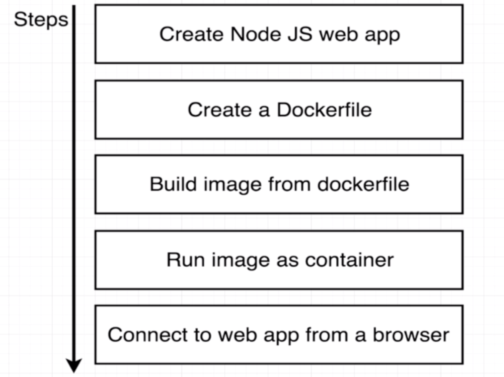
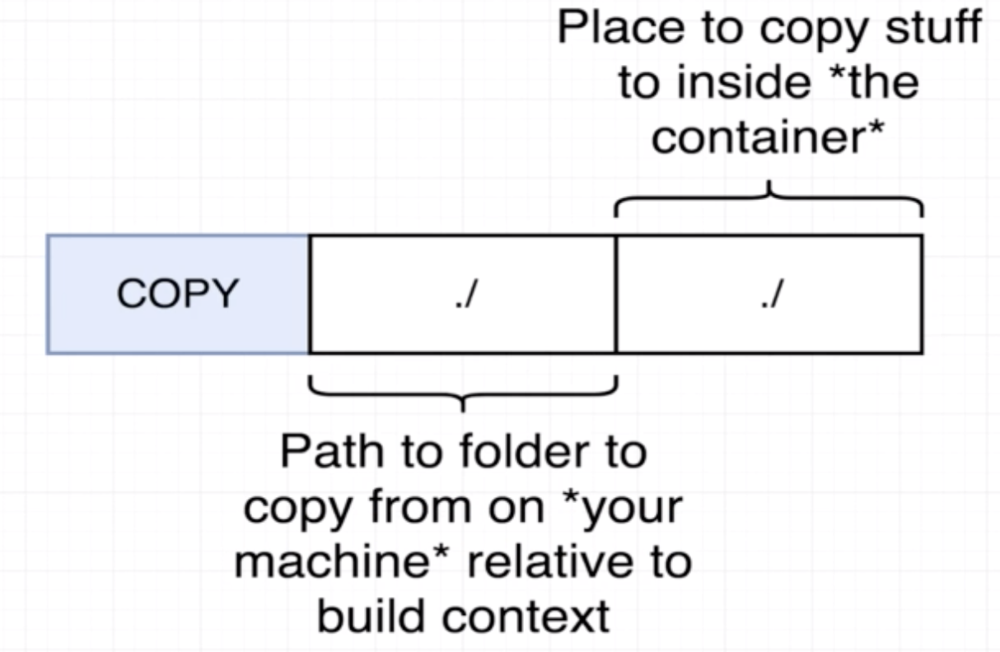

# Project Outline

* create mini Node.js Web App
* wrap inside docker container
* run it on local machine

## How to pass file to the image

## How to achieve container port mapping

WebApp is listening on port 8080. However when running container, we cannot get the message through localhost:8080. Port mapping to achieve redirect into container port 8080.

`docker run -p <localhost/source machine port>:<container port> <image name>`

## How to specify a working directory

`WORKDIR /usr/app` any following command will be executed relative to this path in container.

## How to avoid re-install dependencies if we just amend some of the code

**Docker is sequence sensitive.** `COPY` dependencies first, making dependencies to be installed first, then other files. Therefore, during rebuild the dependencies can used directly from cache instead of installing from scratch.