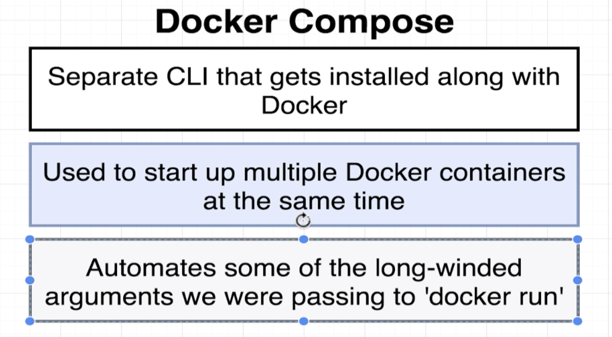

# Docker Compose with Multiple Local Container

## e.g. `Container 1(node.js app)` want to connect `Container 2 (Redis)`

* Use `Docker CLI` to build networking (Rarely Used)
* `docker-compose up` build a compose container(use `docker-compose up --build` for rebuild)


### Code of docker-compose.yml

``` yml
#docker compose version
version: '3'

#services are kind of like container
services:
  redis-server:
    image: 'redis'
  node-app:
    build: .
    ports:
      - "4001:8081"
```

----

### Code of index.js

``` javascript
const express = require("express");
const redis = require("redis");

const app = express()

const client = redis.createClient({
    host: 'redis-server',
    //will connect to the redis server in the same container,the name of the host should be same as the service name in docker-compose.yml
    port:6379
});

client.set('visits',0)

app.get("/", (req, res) => {
    client.get("visits", (err, visits) => {
        res.send("Number of visits" + visits)
        client.set("visits",parseInt(visits)+1)
    })
})

app.listen(8081, () => {
    console.log("Listening on 8081");
})
```

#### Launch Multiple Containers (docker-compose) in background

`docker-compose up -d`

#### Stop Multiple Containers (docker-compose)

`docker-compose down`