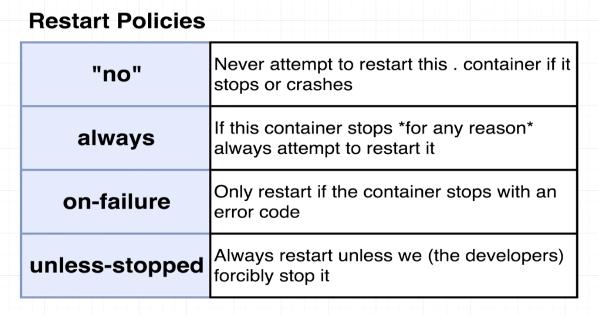

# Compose Container Maintainence

e.g.

* add `restart: always` to node-app in `docker-compose.yml`
* add `restart: on-failure`, will restart with any error code except `process.exit(0)`
* `restart: unless-stopped`, always restart unless stopped from terminal
* ***attention*** `"no"` has quote.

`docker-compose ps` to print out status of one specific compose container(work only in directory with the docker-compose file)