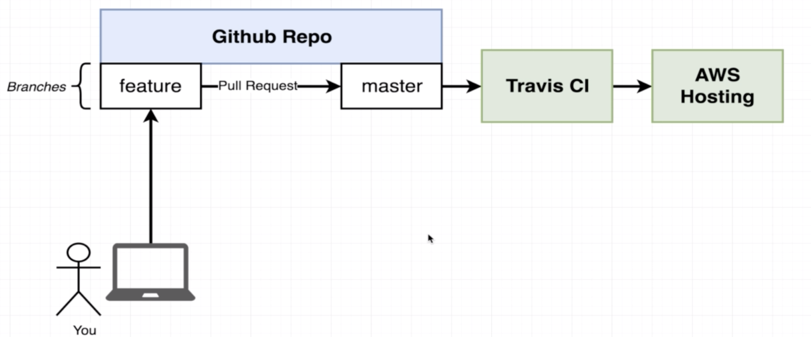
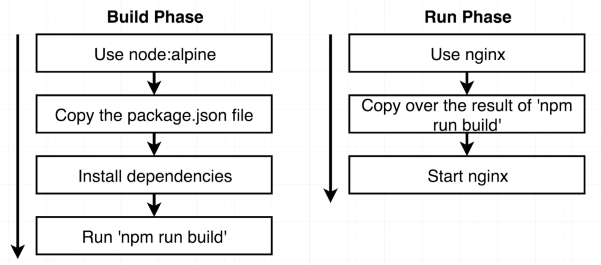
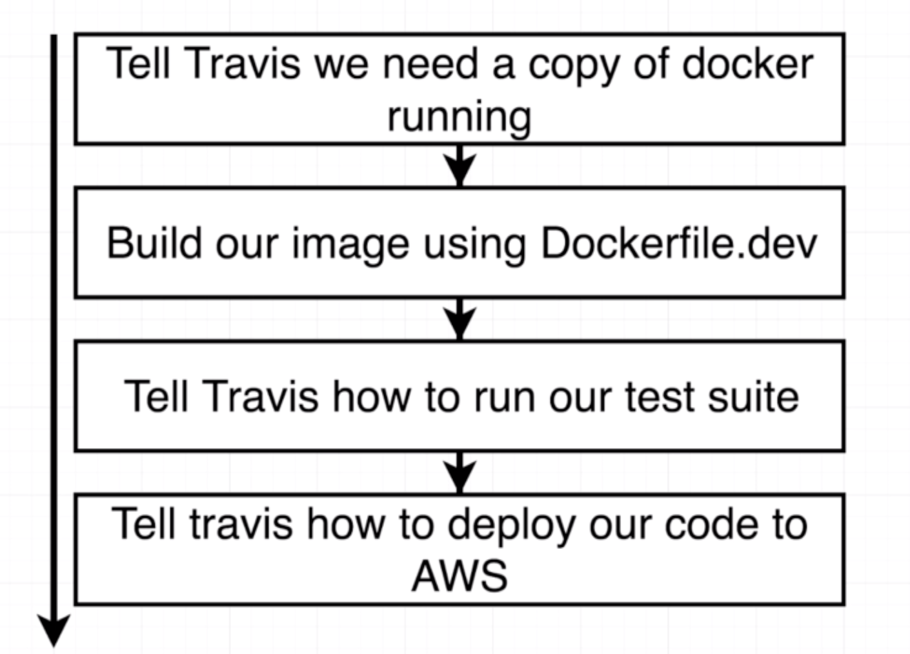

# Single Container Workflow


Travis CI for automation testing.

`Dockerfile.dev` for development, `Dockerfile` for production.

During development, to avoid rebuild of image when editing code, we use ***mapping*** to have reference in **Docker container mapping to local folder**. (also called docker volume)  

## An React Example

### Step 1:  Build `Dockerfile.dev`

``` docker
FROM node:alpine

WORKDIR '/app'

COPY package.json .
RUN npm install

COPY . .

CMD ["npm","run","start"]
```

### Step 2: Build Image

``` docker
Docker build -f Dockerfile.dev .
```

Since the `npm install` will install all the nodes_modules based on package.json, we can delete the nodes_modules to reduce space.

### Step 3: Run Container and Test

``` docker
Docker run -p <local port>:<container port> -v /app/nodes_modules -v $(pwd):/app <Image ID>
```

``` docker
docker exec -it <Container ID> npm run test //test
```

This achieve docker volume (reference) except the mapping of nodes_modules(empty in local folder). So the code change can be reflected realtime in the container.
Or use `docker-compose`

``` yml
version: '3'
services:
  web:
    build: 
      context: .
      dockerfile: Dockerfile.dev
    ports: 
      - "3000:3000"
    volumes: 
      - /app/node_modules
      - .:/app
  tests:
    build: 
      context: .
      dockerfile: Dockerfile.dev
    volumes: 
      - /app/node_modules
      - .:/app
    command: ['npm','run','test']
```

The above `docker-compose.yml` file will create two container one running webapp one running test. (Both auto-update based on local file) However, under this situation docker cannot interact with the running test process.

### Step 4: Serve Application in Production Environment

<div style="text-align:center"></div>

**New `Dockerfile`(for production, no .dev) with below codes:**

``` docker
FROM node:alpine as builder //Build Phase

WORKDIR '/app'

COPY package.json .

RUN npm install

COPY . .

RUN npm run build
```

``` docker
FROM nginx  //Run Phase(default command of nginx will automatically start nginx)

COPY --from=builder /app/build /usr/share/nginx/html
```

Then

* `docker build .`
* `docker run -p <LocalPort>:80 <Image ID>` (80 is default port of nginx)

### Step 5: Travis-CI for Testing

<div style="text-align:center"></div>

``` yml
sudo: required

services:
  - docker

before_install:
  - docker build -t yinfirefire/docker-react -f Dockerfile.dev .

script:
  - docker run yinfirefire/docker-react npm run test -- --coverage
```

Configuration of `.travis.yml`. After pushing to github, Travis-CI will automatically run the test.

### Step 6: Deploy to AWS Elastic Beanstalk by Travis-CI

1. Create a Elastic Beanstalk Web server with Docker configuration.
2. Go to IAM and add user, then grant full access of elasticbeanstalk to travis-ci by passing `ACCESS_KEY` and `SECRET_KEY` to travis-ci environment variables.
3. Edit `.travis.yml`  

``` yml
deploy:
  provider: elasticbeanstalk
  region: "us-west-2"
  app: <app name>
  env: <env is after app name>
  bucket_name: "elasticbeanstalk-us-west-2-843055130065"
  bucket_path: <app name>
  on:
    branch: master
  access_key_id: $AWS_ACCESS_KEY
  secret_access_key:
    secure: "$AWS_SECURE_KEY"
```

### Step 7: Expose Ports from Elastic Beanstalk

add `EXPOSE 80` in `Dockerfile`

``` dockerfile
FROM node:alpine as builder
WORKDIR '/app'
COPY package.json .
RUN npm install
COPY . .
RUN npm run build
FROM nginx

EXPOSE 80

COPY --from=builder /app/build /usr/share/nginx/html  
```

### Step 8: Github Config

1. `git checkout -b <branch name>` to switch to a new branch.
2. Develop on branch, make pull request and merge after test.
