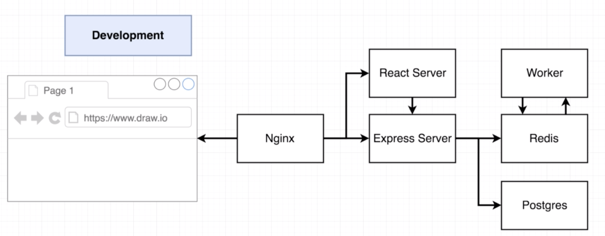
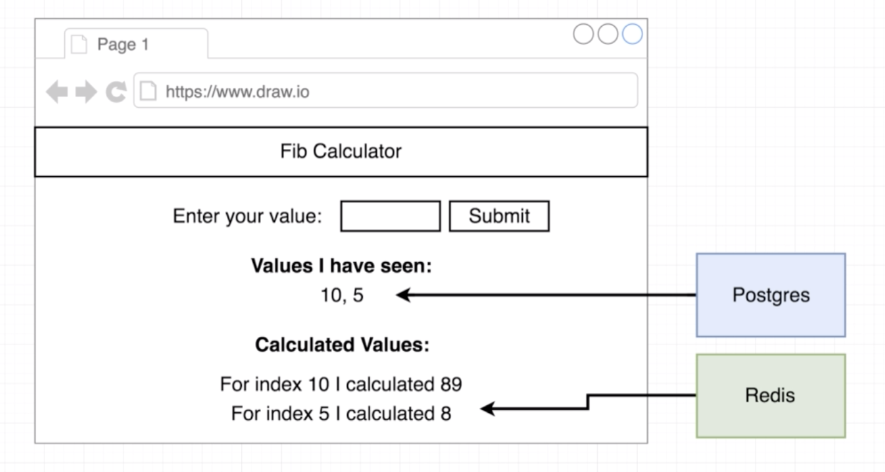
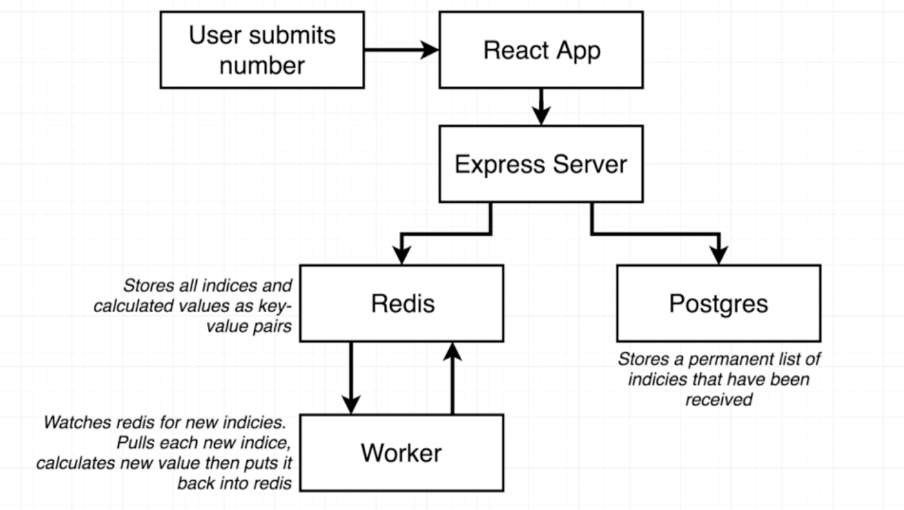

# Multi-Container Deployment (A Fibonacci App Example)

## App Working Flow

* Nginx routes to react server if the request ask for frontend assets.
* Nginx routes to express server if the request ask for access for submitting and retrieving.

* Redis for temporary or cached data.
* Postgres for permanent data.

* Worker watches and retrieve new indices in Redis and return new calculated value.

## Dockerfile for React, Express, Worker